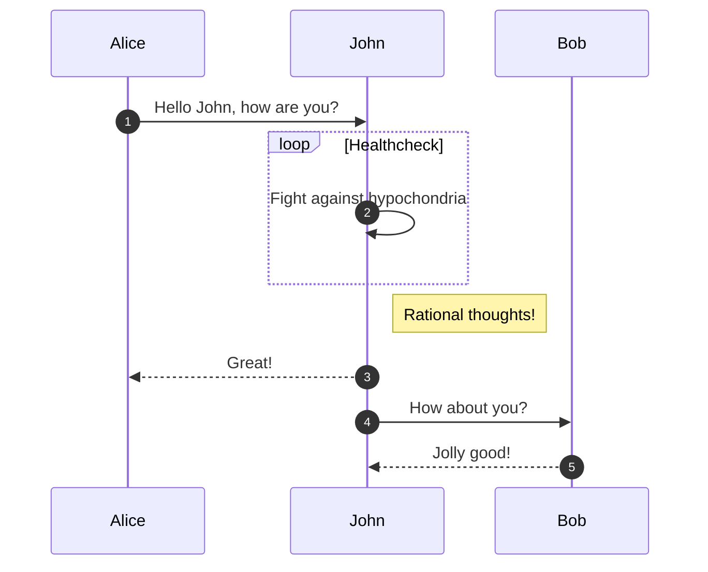

# PostCodeUK
This is a microservices project with Express, Docker and MongoDB about postcodes in the UK. 
## Requirements
 - NodeJS
 - Docker
 - MongoDB
## Servers
- [Save Data](https://github.com/oneCiser/PostCodeUK-MS-save-data)
- [Consume PostCodesIO](https://github.com/oneCiser/PostCodeUK-MS-Consume-PostCodesIO)

# Run project

## Docker
1.  Clone servers in the same root folder
2.  Place in the root folder the file [docker-compose.yml](https://github.com/oneCiser/PostCodeUK/blob/main/docker-compose.yml)
3.  Execute the following command

        $ docker-compose up

## Without Docker
1. Clone the servers
2. Config the **.env** and **.env.dev** files
3. Run the necessary commands specified in the repositories for each microservice

# Project

## Context
The idea was to develop a service that would return the postal codes based on **CSV** files, for this purpose the following considerations were made

- Reduce PostCodes.IO API requests.
- Use microservices
- Data persistence

For this, the data storage was designed with the ability to process and perform geospatial queries of MongoDB allowing to validate if the point sent already has a zip code registered in the database, if this is not the case, a PostCodes.IO query is performed.

## Logic

